# 📊 Diagramas de Arquitetura - SDK e Tool Registration

## 🏗️ Arquitetura Geral do SDK

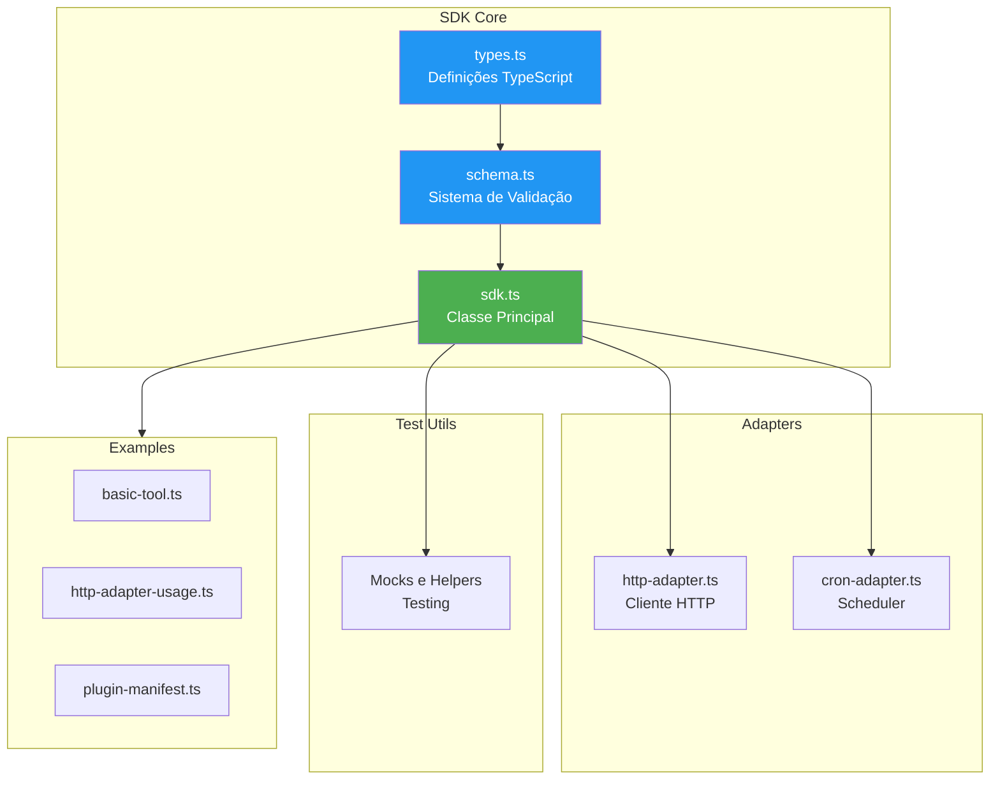

---

## 🔄 Fluxo de Registro de Tool (SDKToolAdapter)

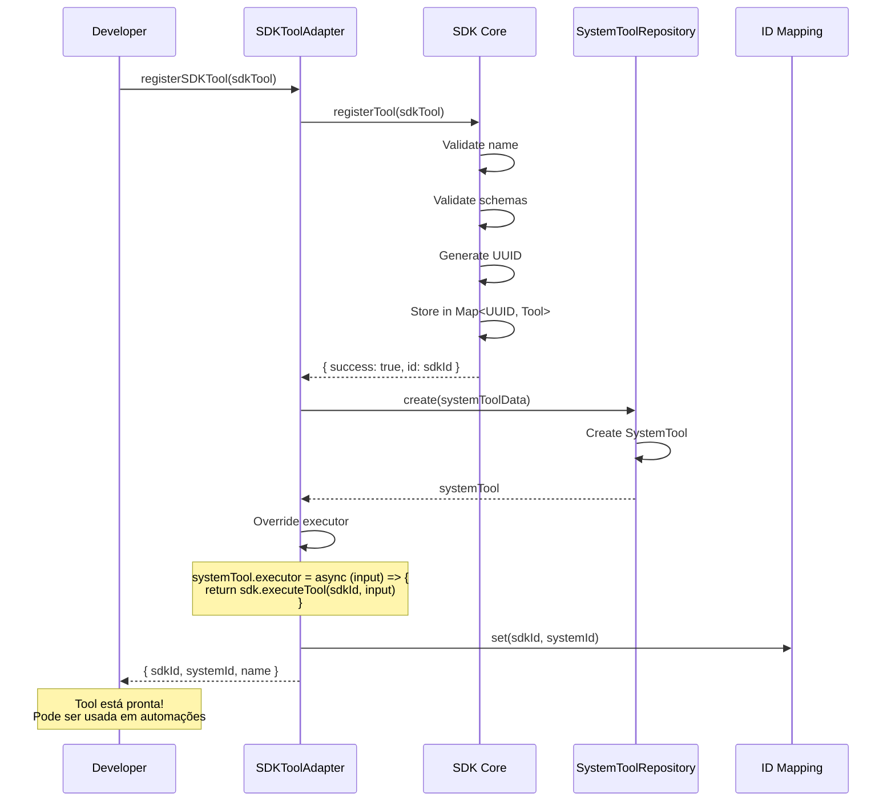

---

## ⚡ Fluxo de Execução de Tool

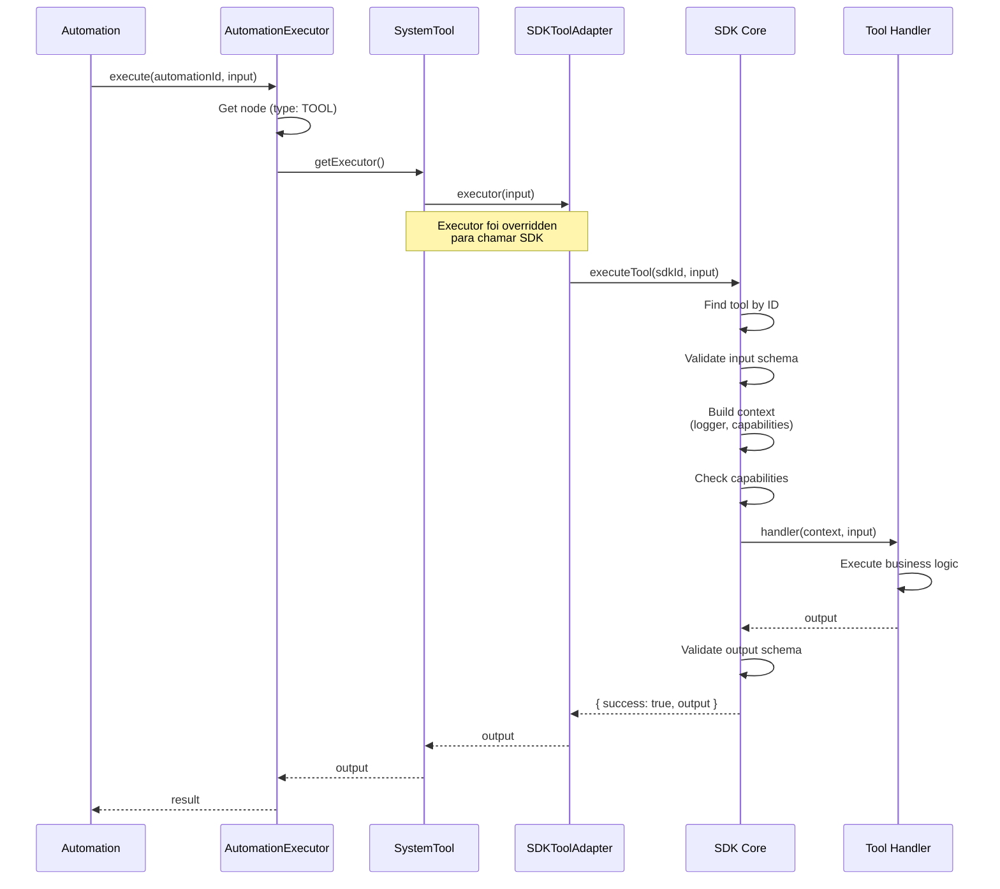

---

## 📦 Fluxo TOR (Tool Onboarding Registry)

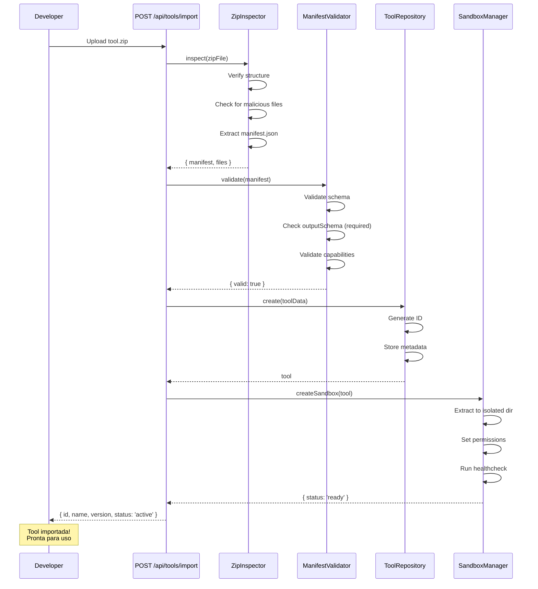

---

## 🔐 Capability Check Flow

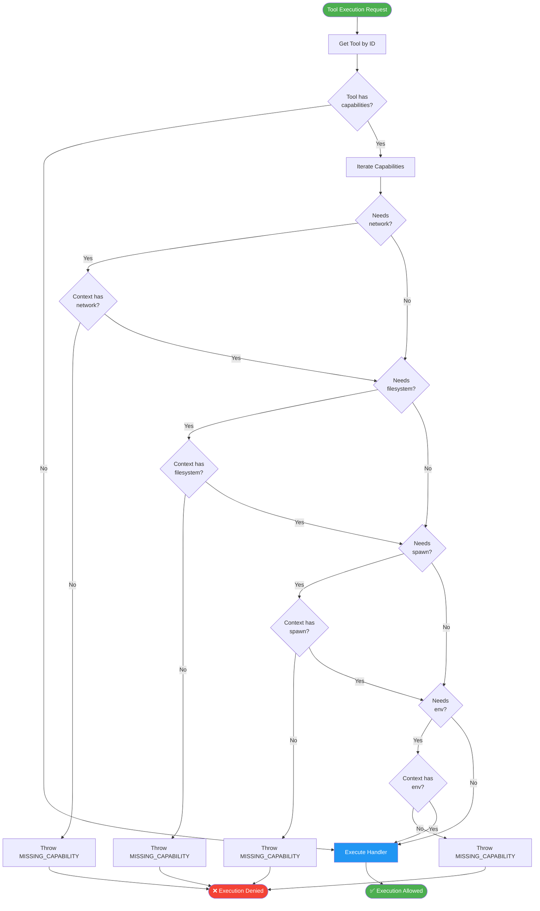

---

## 🎯 Tool Registration: Two Paths

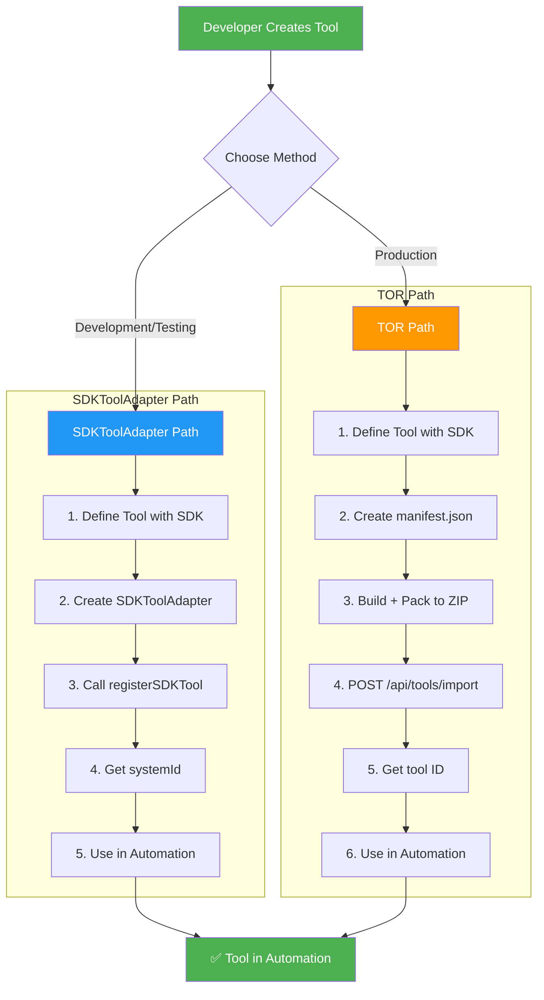

---

## 🔄 Schema Validation Flow

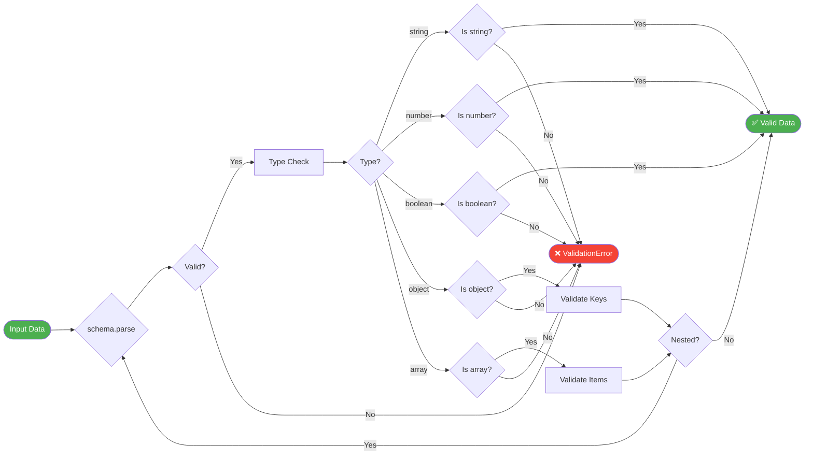

---

## 🏢 Integração Completa: SDK → Automation

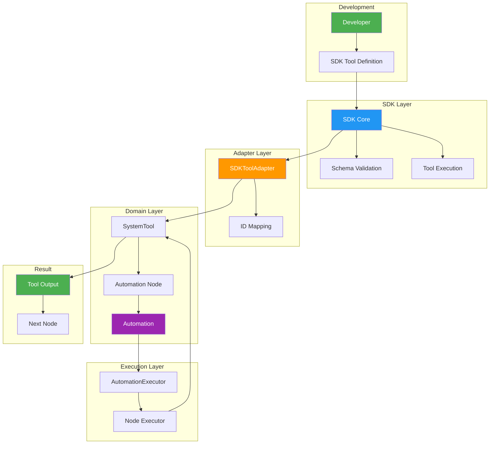

---

## 📊 Component Dependencies

```mermaid
graph LR
    subgraph "SDK Packages"
        Core[@automation-sdk/core]
        Adapters[@automation-sdk/adapters]
        TestUtils[@automation-sdk/test-utils]
        Examples[@automation-sdk/examples]
    end
    
    subgraph "Integration Layer"
        SDKAdapter[SDKToolAdapter]
    end
    
    subgraph "Domain Layer"
        SystemTool[SystemTool]
        Automation[Automation]
        Node[Node]
    end
    
    subgraph "Infrastructure"
        Repos[Repositories]
        Services[Services]
        Controllers[Controllers]
    end
    
    Core --> Adapters
    Core --> TestUtils
    Core --> Examples
    
    Core --> SDKAdapter
    
    SDKAdapter --> SystemTool
    SDKAdapter --> Repos
    
    SystemTool --> Node
    Node --> Automation
    
    Services --> SystemTool
    Controllers --> Services
    
    style Core fill:#2196F3,color:#fff
    style SDKAdapter fill:#FF9800,color:#fff
    style SystemTool fill:#4CAF50,color:#fff
    style Automation fill:#9C27B0,color:#fff
```

---

## 🔄 Tool Lifecycle

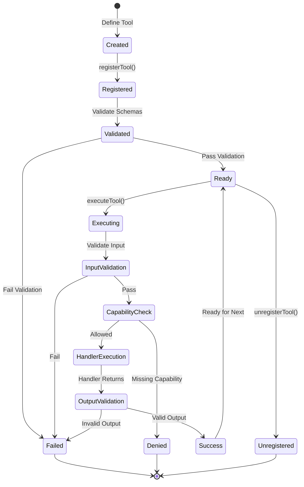

---

## 🏗️ Clean Architecture Layers

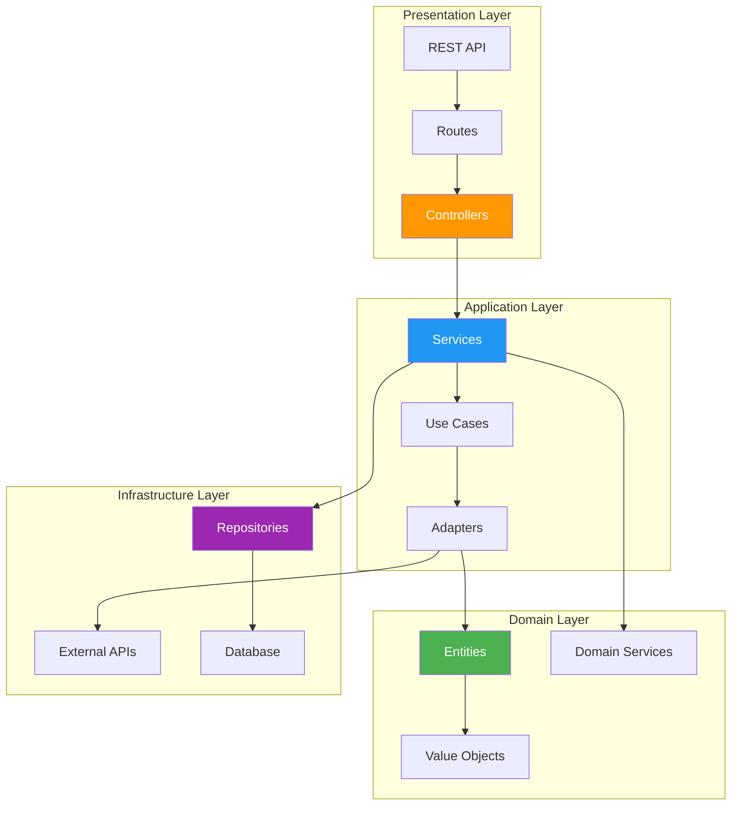

---

## 🎯 Decision Tree: Which Method to Use?

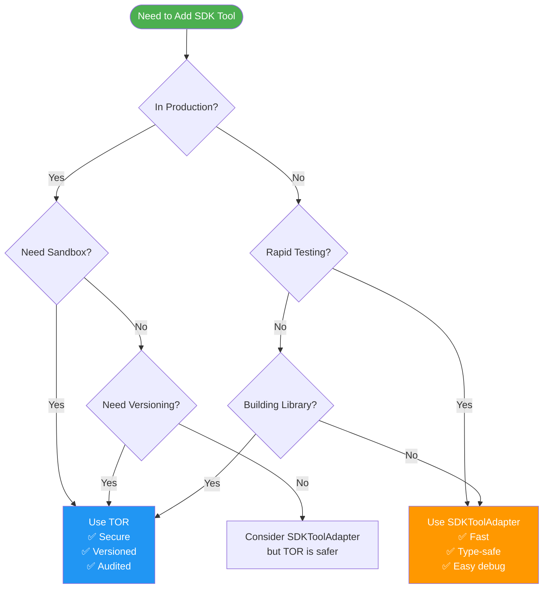

---

## 📈 Performance Considerations

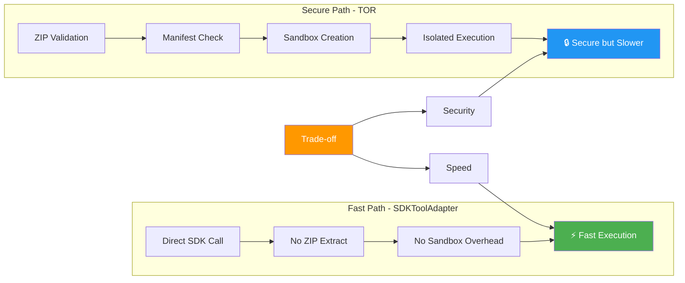

---

## 🔍 Debugging Flow

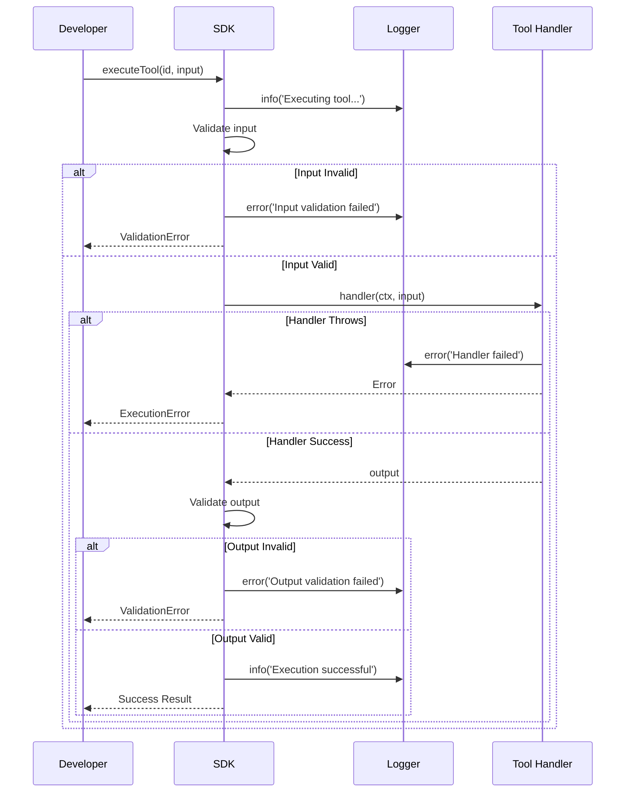

---

## 🎊 Summary Diagram

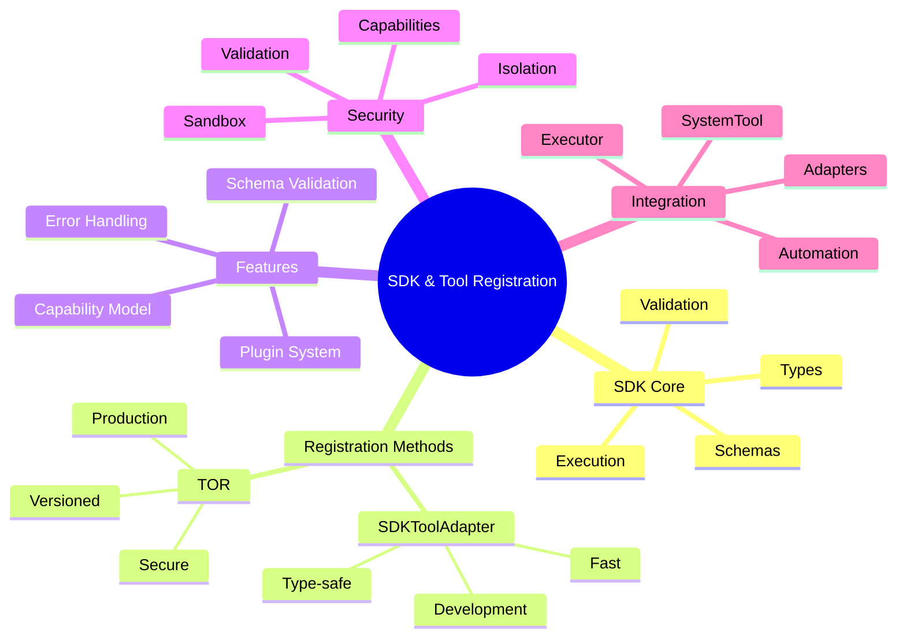

---

**Todos os diagramas estão em formato Mermaid e podem ser visualizados em:**
- GitHub
- VSCode com extensão Mermaid
- Markdown viewers com suporte Mermaid
- https://mermaid.live/
